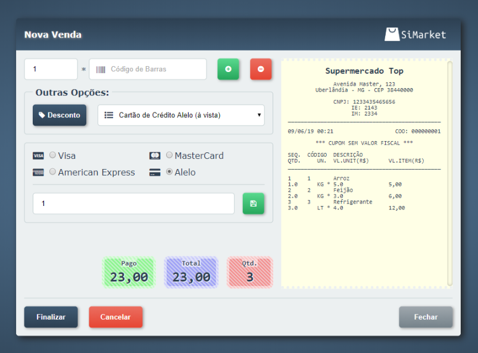

# Sistema de Supermercado



Sistema experimental para caixas de supermercado, desenvolvido para prática de aplicação de Design Patterns. O sistema possui controle de estoque, controle de vendas, controle de notas e moedas, controle de acessos de usuário e relatórios.

Neste arquivo você encontrará instruções para instalação, imagens demonstrativas e também tecnologias e conceitos utilizados nesta aplicação.

[Demo #1](demo/demo_1.png) - [Demo #2](demo/demo_2.png) - [Demo #3](demo/demo_3.png) - [Demo #4](demo/demo_4.png) - [Demo #5](demo/demo_5.png) - [Demo #6](demo/demo_6.png) - [Demo #7](demo/demo_7.png) - [Demo #8](demo/demo_8.png)

## Primeiros Passos

Siga estas instruções para ter uma cópia do projeto funcionando em seu computador.

### Pré-requisitos

O que você precisará:

```
IDE Netbeans EE
JDK
Apache
PostegreSQL
```

### Instalando

Siga os passos a seguir para rodar esta aplicação em seu computador.

> Caso não esteja interessado no desenvolvimento, vá para a página [Releases](https://github.com/steffmartin/supermercado/releases) e baixe o compilado para executar.

#### Banco de Dados

O sistema criará o banco de dados automaticamente, desde que o usuário e a senha do PostgreSQL sejam `postgres` e `root`, respectivamente.

> Caso queira executar o sistema com outras credenciais de acesso ao banco de dados, modifique o arquivo [DataBaseConnect.java](src/java/JDBC/DataBaseConnect.java).

#### Obtendo uma cópia

Faça o download, use uma ferramente Git ou a própria IDE Netbeans para clonar este repositório:

```
No Netbeans, vá em Team → Git → Clone.
Informe a URL e clique em Next → Next → Finish.
```

### Executando

Execute o projeto normalmente pela IDE:

```
No Netbeans, com o botão direito sobre o projeto, vá em Run
```

O servidor estará pronto quando a mensagem abaixo for exibida no console:

```
CONSTRUÍDO COM SUCESSO (tempo total: XX segundos)
```

## Demonstração

O sistema pode ser acessado pela URL `http://localhost:8084/SiMarket`

#### Primeiro acesso

No primeiro acesso será criado a base de dados, usuário e dados da empresa. Siga os passos da instalação guiada.

#### Utilização

Use as caixas para navegação:

```
Vá em Config. Empresa para preencher as informações cadastrais da empresa
Vá em COnfig. Caixa para informar o saldo inicial do caixa
Vá em Produtos para cadastrar os itens a serem vendidos e seus saldos iniciais
Vá em Usuários e cadastre os usuários do sistema e suas permissões de acesso
Vá em Trocar Senha para modificar as credenciais do usuário autenticado
Vá em Nova Venda para efetauar uma venda
Vá em Continuar Venda para voltar a uma venda já iniciada e ainda não finalizada
Vá em Vendas para ver o registro das vendas realizadas
Vá em Relatórios para ver informações cadastrais, saldos e vendas
```

#### Capturas de tela

[Demo #1](demo/demo_1.png) - [Demo #2](demo/demo_2.png) - [Demo #3](demo/demo_3.png) - [Demo #4](demo/demo_4.png) - [Demo #5](demo/demo_5.png) - [Demo #6](demo/demo_6.png) - [Demo #7](demo/demo_7.png) - [Demo #8](demo/demo_8.png)

## Deployment

Distribua este projeto como um arquivo *.war para rodá-lo em um servidor Apache:

```
No Netbeans, com o botão direito sobre o projeto, vá em Clean and Build
```

> O arquivo *.war será criado na pasta `dist` do projeto.

## Tecnologias utilizadas

* [Servlets](https://docs.oracle.com/javaee/5/tutorial/doc/bnafd.html) - Java Servlet
* [JSP](https://www.oracle.com/technetwork/java/index-jsp-138231.html) - Java Server Pages
* [Scriptlets](https://docs.oracle.com/javaee/5/tutorial/doc/bnaon.html) - JSP Scriptlets
* [Apache](https://www.apache.org/) - Servidor Web
* [PostgreSQL](https://www.postgresql.org/) - O SGBD adotado
* [jQuery](https://jquery.com/) - Biblioteca JavaScript
* [Font Awesome](https://fontawesome.com/) - Biblioteca de ícones

### Conceitos teóricos aplicados

* [Singleton](https://pt.wikipedia.org/wiki/Singleton) - Design Pattern
* [Observer](https://pt.wikipedia.org/wiki/Observer) - Design Pattern
* [Decorator](https://pt.wikipedia.org/wiki/Decorator) - Design Pattern
* [Factory Method](https://pt.wikipedia.org/wiki/Factory_Method) - Design Pattern
* [Chain of Responsibility](https://pt.wikipedia.org/wiki/Chain_of_Responsibility) - Design Pattern
* [MVC](https://pt.wikipedia.org/wiki/MVC) - Design Pattern
* [DAO](https://pt.wikipedia.org/wiki/Objeto_de_acesso_a_dados) - Design Pattern

> O documento `Justificativa dos Padrões Utilizados`, disponível na página [Releases](https://github.com/steffmartin/supermercado/releases), explica como cada padrão foi demonstrado neste projeto.

## Autores

Steffan Martins Alves - [LinkedIn](https://www.linkedin.com/in/steffanmartins/)
Heitor Henrique Nunes - [LinkedIn](https://www.linkedin.com/in/heitor-nunes-7b1322176/)

## Licença

Este projeto está licenciado sob a GNU Affero General Public License v3.0 - leia [LICENSE.md](LICENSE.md) para mais detalhes.
